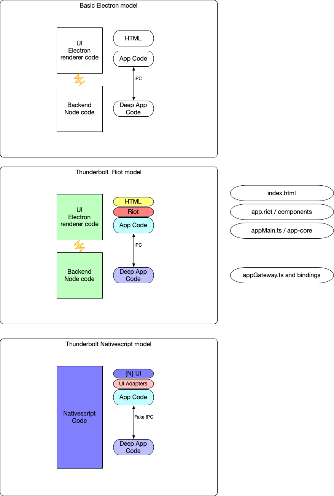

started with a copied shell of earlier ThunderBolt setup,
so we have Electron and Riot parts in place, and the app runs
an empty "Hello World" screen.

Now I want to get the NS parts in place:

Doing this:
```
tns create ThunderBolt-NS --ts --path ./NativeScript --appid tbd.tbns.app1
```
and it creates NativeScript / ThunderBolt-NS tree

doing 
```
tns run android [--device medium]
```

will build and run the default NS tap counter demo app.

so, now to connect to our own app...



I think what we want to do is:

- commonize `app.riot` and `main-page.xml` as the main layout page
- Each of these is backed by component observables that respond to app and
update the properties of the layout
- Each of those components has a common API interface 
- this interface is implemented accordingly in each environment
- app code calls one or the other depending upon environment

### First cobbling: A Simple label

Let's do "Hello World" using a simple label control.

Let's do this in the Electron/Riot (Desktop) world first.
 - √ Okay. `6e53372efeaa5fd2b2640977741805ef88649e63`
 
Now do the same thing, without connection to desktop yet, in {N}

 - √ Cooliomente
 
 Now let's create an app activity module that will be called
 at app page start in either case and set the label there.
 
  - √ Desktop version ready. Needed to rearrange due to some clean build problems.
  - checking it at `f91c84f8670e5f4e719633628ad0a29e3c0bc74b`
  
----
#### Creating the adapters and bindings for the Nativescript side

- AppModel is used by TB to hold a series of proxied 'sections'
as though objects in an object tree.

- For {N} we can do the same thing, substituting an `Observable`
for `proxy`.
###### Comparison
- the TB Binding class / bindings map records bindings for both
up and down communications and also allows a callback for 
onChange to be called.
- the component Common bind action registers this callback so that
it can commute changes on the model to the component.
- Despite the bi-directional setup, nothing actually is using
the downward path.  Components update the model directly.
But we could have an updateValue method that does this for us
by setting the model at the component's bound path. 
(_note there is the method `toModel` in the AppModel.ts code, it's
just not called from `Common`)

- The proxy sections are pretty analogous to Obervables. The
`announce` function is similar to `notifyPropertyChange`

###### Idea summary
- in {N}, we define a `Section` as an `Observable` 
and we add an `updateValue` method to it (downward)
we build setter/getter aliases so we can access this
as we expect, and add an onPropertyChange to catch downward
updates.

- Make an AppCore that mimics the key functionality of
TB, namely:

- Model access

- `createUtils` injectable APIs for common utility classes (TBD)
as in how we did StringParser in prototype.

- Common structured Logging should go here too.
Expand in time, but can pull from Sniff Log.

- Navigation: Ability to change pages, desktop options for windows, etc.
- commonized alerts
- commonized general modal 

###### Common `Common` interface
- just to keep things simple. may have necessarily unique bits.

###### Pipe Dream - Universal component declaration
- specify markup in a common format that can convert
- map layout containers and properties
- specify bound sections - this makes a combined model in
{N} and fills the `bound` object for TBRiot.
- 'on' Handlers can be maintained separately, but we may
find common ground here too.

###### Non-sequitor and/or refactor location
- SemVer
- flatten
--------

###### Where I'm at with this:

- Working on how to create a common layer to bridge to
{N} components.  Something equivalent to TBRiot common stuff.
- I guess since we are creating all new Framework components,
we can base each of them off of `NSCommon` or whatever, and
have this base define our specialized property tags (`bind`)

- See `components` and the files I started there.
- end of 12/1.
- Revisit 12/2: See next section for new approach thoughts

####### Binding syntax
- I want to keep sections un-nested, and I want `bound` set to
not have any collisions, so we need syntax like

```
bind="SomeSection.foo"    {foo}
bind="AnotherSection.bar" {foo, bar}
bind="AnotherSection.foo as baz" {foo, bar, baz}
```  
We also want to subclass Page so we can establish our scope
We'll also have scope in our container classes (e.g. StackLayout, et al)
Scope can also be local to the component, but we don't want to have to do that for each component, so 
scoped inheritance is a good thig.
    
so, we want our NS xml to look something like this:
```
<TBPage bind="FirstSection.foo as bar, NextSection.thing as value, Dohickey.item, Another.thing">
    <Simple-Label text="{{ bar }}"/>
    <Simple-Button name="{{ item }}="{{ onTap }}"/>
    <Simple-Label bind="SomeOtherSection.value" text="{{ value }}"/>

            ...    
```
---------

##### New approach thoughts
12/2

Code should be portable and common up to the Riot/NS Component
layer.  All model/section binding should work in both worlds
the same way up to that point.

SO:
Hoping to do this list with 1-2 days per task.  GO!

- [X] Refactor TBD (ThunderBolt Desktop) with a more succinct and
articulated AppCore/AppModel binding story
    - [X] Common.js should become Common.ts
    
- __12/4__    

- [ ] Build out some basic components and tests in TBD mode
    - tap and count
    - get input from text view
    - choose a picture by name in a radio list

- [ ] handle new page navigation

- [ ] All app action is in the `activitySource` page files

- [ ] app-core is potentially shareable and might relocate folders

- [ ] component code (riot / NS xml+back) is separate

If we get to this point with some basic examples before mid-month, 
we can afford to spend a few days on the pipe-dream of 
common component construction to address that last check item
in a more elegant way.

I'm thinking a single file that has a common section that is
translated into markup/code for either side, as well as 
independent sections of native code.
Options are: native only, before, or after generated common code,
applied to markup and code separately. 
 
###### How to load a page
in the original appmain start, we see this code
```
  console.log('now mounting and running Riot app')
  app = mountApp( document.getElementById('root'), { app: coreApp } )
``` 
 where mounApp was previously defined as 
 ```
const mountApp = riot.component(App)
```
and App is the main page import
```
import App from './app.riot'
```

which implies that to import a page, we
1. define the page markup starting with the <app> tag and import it
2. make it a component function with riot.component
3. call the component function to bind it to our root element.
4. pass the properties we want (e.g. app)

In {N} we import our own version of Page so we
have effectively the same access at the same scope

###### Current Point of Kerfluffle
  
- Devise lifecycle scripts and move webpack copy
to a `beforeBundle` phase.
    - before compile
    - after compile
    - beforeBundle
    - after bundle
    - preLaunch
    - postLaunch?
    - postRun?  
  
- [ ] redo lifecycle by creating an NPM plugin
    - registers bin 'lcx'
    - lcx enumerates .js scripts in a lifecyle named directory
    - does node execute them in alpha order.
    
 - [ ] include a before-compile task that enumerates
  appSource directory and makes app-page-directory.ts
  or after-compile that makes app-page-directory.js in build
  based on base names of .riot files.      

 - [X] construct a history stack in coreApp
 - [X] support of back handling
    - √ keyhandler
    - action bar with back, title, tool areas
    
------

 - Start on Nativescript side
 1. get Nativescript side to run at all again
 2. Have it load core and model
 3. execute navigation via core
 
 -----
 ###### How it works nativescript side

- app.ts -- simply runs app-root (xml invokes frame that points
to main-page
- app-root.xml could be generated to point to <main> page.
- pages invoke components, like in TBD

###### TODO List
Need to finish the parallel common code and tooling
Just getting it set up now.
- [X] Create ComponentBase and refactor simple-label for it.
- [X] no local XML. Construct the controls in `createControl`
- [X] hand-match to TBD proto, do new page nav and back
- [X] establish environments and use to diff common code
- [X] make Bridge (with copy-core)

-----------
###### Where I am 12/6
- Have the {N} stuff working well so far.
- Connecting onClick is a matter of the singleton, I think.
- That, plus some boilerplate nav and back-handling should
satisfy the top three above.

Finish out the checklist above, at any rate...

Next matter at hand is the pages.
The `activitySource` code is nice and potentialy remains portable
but I need to ferry it to a more local location in {N} or else
things get wonky. 

So, an export is needed anyway.

Maybe something like:

- enumerate the pages and:
    - copy the .ts file to '(name)-logic.ts' in the {N} space
    and generate a boilerplate oage file that imports this.
    - read the riot file and generate an xml from it, using
    our own namespace
    - note this means making a nemespace file with all the
    exports (could also generate with enumeration))
   
###### For both: navigation lifecycle
- {N} has navigatingTo/From and navigatedTo/From, loaded, unloaded
- we currently have startApp, which is a misnomer to begin with.
- Pages: beforeStart, started, beforeEnd, Ended
- app: startup (before main start), shutdown
- fatal crash catch.

###### Environment info
- framework: ThunderBolt/Desktop, ThunderBolt/Mobile
    - version
- platform: MacOS, Windows, Linux, Android, iOS
    - OS version
    - Node version
    - Electron version
    - Nativescript version
- defines: 
    - arbitrary name/value set [object tree]
- screen:
    - pixelSize
    - physicalSize
- storage:
    - appRoot
    - dataRoot
    - availableSize    
- capabiliities:
    - keyboard
    - mouse
    - touch
    - Internet
    - sound
    - microphone
    - camera 
        - still
        - video
    - haptics
    
###### Component construction
- riot: Consider dropping `bound` in favor of existing `state`
- commute any props directly to bound state
- do binding in scope (will override props)

so we have
- markup : riot / ns
- style
- props
- handlers (normalize)
- riot / ns specific callbacks


###### where at on 12/8

- Environment in place enough to work with, needs expansion
- buildcycle is working okay
- webpack warnings for out-of-platform includes
- copy-core is okay for core
- need a pages solution...
- Bugs introduced:
    - DT works right until we backspace.  main state is not refreshed.
    - NS navs okay, but no mainLabel on either screen.
    
-------
###### Stumping bug: Desktop (will look at NS after...)
Tried many things, but it seems that when we unmount --
which seems to work per lifecycle reports and then
remount, we lose the connection to 'update'

- If we don't unmount, it creates appended content
(which makes sense)
but the new content doesn't react -- the original context does.

- I think the problem lies with re-using 'app'

- New approach will be to stage up 'app' in main,
with a slotted container like `<page-select>` from projectus.

- This means we need to declare all of our pages at once, like
```
<app>
    <page-select bind='navigation.currentPage as pageId'>
        <page-one id="page1"/>
        <page-two id="page2"/>
        <page-three id="page3"/>
    </page-select>
</app>
```         
We later explore the idea of generating this from an enumeration
of pages, but let's keep it hand-cobbled for now.

Switching pages is then a matter setting the id in the app model.
the rest is handled by the component logic to hide/show.

All pages are retained. We could look at unmounting
unused pages and mounting just the active one.
The results we are seeing now imply that should work, and
it allows us to do page cleanup.  We could even make
`disposable` a page option/state. 

###### (sigh)... okay
This is kind of a cool pattern and might be worth keeping.
I like how I can bind the page 'activity' code to the XML

But it's not the problem.
Best I can tell, I need to record the component instance
in the binding rather than relying on the closure scope.

Let's try that next.

_Cool. That was it_. Well, almost.  That plus needing to clear
the bound values on unmounting.

###### So now we can see about
- Getting NS to work with changes to AppCore and ComCommon
- Generating the app.riot page
- Generating the NS pages

###### NS Timing
- Race in loading: we get exception when binding because setupUIElements
has not been called before the component gets built.
- May need to put a promise gate at the app that is watched at ComCommon
so the component can wait before building the control.
Use this alongside _isInit...

###### What seems to be happening
- appMain loads the core and sets up the model
- *then* calls to load the main page
- page loads and onloaded is called
- *simultaneously* the XML invokes the controls
- the controls call to the app, but it may not be ready yet
- so if the control waits for the setupUI promise to
trip before building the control, we should be okay.

_The stuff tomorrow is made of_

###### Now what?
So, gating is in place and it is indeed at least part of the solution.
No more race-related crashing.

But now we find the following issues:
- First setAtPath fails because there are no bindings yet.
I think this is because of the setTimeout in creation, which
may not be necessary (was only necessary before for iOS, not sure
if it will still be when we get there)

- Back navigation doesn't go through 'onLoaded' -- so we
need to one of the following:
    1. Stop using {N} history and use our own instead
    2. go through 'navigatedTo' instead of 'loaded'

_Time for a walk. I see blue sky_

After some tests, plus some philisophical musing, I like
option 1 the best.

So that's my next task. Haven't looked at the setAtPath / binding
race yet, by I did take out the timeout and that's not the
problem.  

The problem there must be that my gate isn't working like I think 
it is, or else it wouldn't be executing the page until after
the component had registered.

Yep.  Fixed that problem.

But the point about the history still stands.
- If we simply switch to 'navigatedTo' we don't get a frame
like we do on 'loaded', 
so we would need to collect that differently if we switched
to that event (although I think it would work as expected after that).
- might be easier to reconnect our own history.

- Okay. Done. But problem with that is this doesn't disconnect
the back action and default handling of the platform, so
we need to trap this event.

- Argh. Now I remember why {N} pisses me off.  The mid-level handling
between the platforms has no common layer to interact with.
So I can find examples for trapping the Android back event, but
iOS is totally different (and multi-path due to gestures).  Why the
hell isn't there a mid-level stage that accepts these whatever sequences
from the native platform and accepts/rejects the handling?
I suppose someone could make an interesting NS plugin for this,
but I'm not in the mood.
- Switching gears to go back to navigatedTo. use Frame.topmost().

##### Okay. Now it's good
√  Need now to fix the desktop because the gates are not
used there.

Also should generate the loaded and navigatedTo handlers rather
than having them be in the launch template.

Also should clean up the once-again irrelevant history.
 
    


